<div align="center">

<h1>CHOI GIHO</h1>

<p><strong>Quality Engineering · Data Analytics</strong></p>

<p>
  Statistical Process Control · Root Cause Analysis · Machine Learning
</p>

<br/>


<br/>

[](https://github.com/mxntchxcbass)

<br/>


</div>

<br/>

## `About Me`

I'm a quality engineering candidate bridging **statistical process control** and **applied data science** — treating defect detection, root-cause analysis, and anomaly detection as a single quality-cost problem, not separate disciplines. Most of my project work sits in defense-manufacturing-adjacent domains: sensor-based defect classification, SPC control charting, and ML pipelines built to survive contact with messy factory-floor data.

```bash
ROLE="Quality engineering candidate — QA/QC"
EXP="New graduate; project and competition experience"
DOMAIN="Defense and precision manufacturing"
STACK="Python, SQL, scikit-learn, XGBoost, Streamlit, Tableau"
OPEN_TO="QA/QC Engineer roles in defense and manufacturing"
```

<br/>

## `Tech Stack`

<div align="center">

**Languages & database**


**Machine learning**


**Development & systems**


</div>

<div align="center">


</div>

<br/>

## `Specialties`

<div align="center">


</div>

<br/>

## `Areas of Expertise`

| Domain | Proficiency | Details |
|---|:---:|---|
| Statistical Process Control | Applied in projects | Nelson / Western Electric rule-based control charts implemented on real sensor data |
| Hypothesis Testing & RCA | Applied in projects | Mann-Whitney U, BH-FDR correction, bidirectional-deviation (abs-z) feature design |
| Supervised Defect Classification | Applied in projects | RandomForest / XGBoost / logistic regression, recall-priority threshold tuning |
| Anomaly Detection | Project experience | IsolationForest, One-Class SVM, LOF — sequence- and timepoint-level scoring |
| Data Pipelines & Automation | Applied in projects | Staged pipelines, parquet caching, rollback-gated experiment stages |
| Dashboards & Reporting | Project experience | Streamlit apps, Tableau dashboards, MES-style quality dashboards |

<br/>

## `Featured Projects`

Project scope and results below reflect my project records. Scores use each project’s own evaluation setup.

<details open>
<summary><strong>🟠 Anodized-Coating Defect Early-Warning System</strong> — SPC · defense manufacturing</summary>
<br/>

Built a unified defect-classification and anomaly-detection pipeline on anodized-coating sensor data (volt / ampere / temperature), designed around a quality-cost tradeoff rather than raw accuracy.

| | |
|---|---|
| **Stack** | Python, pandas, scikit-learn, XGBoost, statsmodels |
| **Scale** | 100 part sequences, 11 defect types, 2 machines |
| **Impact** | Compact 11-feature hypothesis-grounded model (ROC-AUC ≈ 0.98) outperformed a 96-feature baseline; F2-tuned threshold (≈0.32) achieved full defect recall in the reported evaluation; LOF-based anomaly detection separated sequences at ≈AUC 1.0 |

Reported project finding: single-direction mean tests failed because defects scatter bidirectionally — absolute-deviation features were the actual signal, and survived BH-FDR correction.

</details>

<details>
<summary><strong>🟠 Smart Factory Quality Grade Prediction</strong> — capstone project</summary>
<br/>

Designed the project around three testable hypotheses (sensor composition, active-sensor configuration, and quality-driver variables all differ by product line), prioritizing leakage prevention over leaderboard score.

| | |
|---|---|
| **Stack** | Python, XGBoost, CatBoost, nested cross-validation |
| **Scale** | ~900 rows × ~2,900 engineered features |
| **Impact** | Nested 3×3 CV with 1-SE rule and MNAR-aware missingness testing; chose the leakage-safe macro-F1 model over a higher but leaky score |

</details>

<details>
<summary><strong>🟠 Mosquito Flight Trajectory Prediction</strong> — DACON competition</summary>
<br/>

Predicted 3D mosquito flight position from LiDAR trajectory data under a strict HIT@1cm evaluation metric.

| | |
|---|---|
| **Stack** | Python, LightGBM, physics-informed feature engineering |
| **Scale** | Multi-version pipeline, staged rewrite (S1–S3.5) |
| **Impact** | Local-frame rotation + residual prediction pipeline; refactored ~3,679 lines into ~1,783 lines across a modular structure; best leaderboard score ≈ 0.6778 |

</details>

<details>
<summary><strong>🟠 Steel Surface Defect Classification</strong> — team project</summary>
<br/>

Team ML project on the UCI steel-defects dataset, evaluating whether a defect classifier could plausibly extend into a predictive-maintenance workflow.

| | |
|---|---|
| **Stack** | Python, scikit-learn |
| **Scale** | UCI steel surface defects dataset |
| **Impact** | Quality-inspection framing: concentrated inspection resources on the hardest-to-classify defect classes |

</details>

<details>
<summary><strong>🟠 Seongnam Public Data Visualization Competition</strong></summary>
<br/>

Built a composite "alley commerce vitality" score from public datasets and self-collected review data, with geospatial boundary generation.

| | |
|---|---|
| **Stack** | Python, Selenium, geopandas, alphashape, folium |
| **Scale** | Custom Naver Maps crawler with bot-detection mitigation and checkpoint/resume |
| **Impact** | Combined review count, business survival rate, and category diversity into one vitality index with Alpha Shape / Concave Hull district boundaries |

</details>

<details>
<summary><strong>🟠 Audio-to-Sheet-Music App</strong> — personal project</summary>
<br/>

A Streamlit app that converts stem-separated audio into playable sheet music, built on the side to combine a music hobby with an ML pipeline.

| | |
|---|---|
| **Stack** | Python, Streamlit, Spotify Basic Pitch, LilyPond |
| **Scale** | Personal tool, multi-layer post-processing on model output |
| **Impact** | Outputs staff notation + guitar tab (PDF via LilyPond), MIDI export, and waveform playback |

</details>

<br/>

## `Project Experience`

New graduate with project and competition experience; no formal employment to date.

- **Ongoing** · DAKER (DACON) Hackathon — drug-prevention idea challenge, quality/SPC-lens proposal
- **Ongoing** · 2026 K-Health unopened medical-data competition — SPC-based in-hospital early-warning score
- **2026.06 – 2026.08** · Smart Factory Quality Grade Prediction — bootcamp capstone project
- **2026.05 – 2026.06** · Anodized-Coating Defect Early-Warning System — bootcamp applied project (defense manufacturing)
- **2026** · Steel Surface Defect Classification — team ML project
- **2026** · Mosquito Flight Trajectory Prediction — DACON competition

<br/>

## `Achievements`

<div align="center">

| Credential milestone | Status |
|:---|:---:|
| ADsP | Obtained |
| SQLD | Obtained |
| OPIc | Obtained |

</div>

## `Education`

<div align="center">

[](https://www.skku.edu/eng/)

</div>

<br/>

## `Certifications`

**Obtained**


**In progress**


<br/>

## `Github Stats`

<div align="center">




</div>

## `Github Trophies`

<div align="center">


</div>


## `Contribution Activity`

<div align="center">


</div>

<br/>

## `Github Summary`

<div align="center">


</div>

## `Contribution Snake`

<div align="center">


</div>

## `Current Focus`

```yaml
currently:
  building:
    - "DAKER (DACON) Hackathon: drug-prevention & harm-reduction idea challenge (QA/SPC-lens proposal)"
  exploring:
    - "2026 K-Health unopened medical-data competition (SPC-based in-hospital early-warning score)"
  learning:
    - "품질경영기사 (Quality Management Engineer certification)"
    - "산업안전기사 (Industrial Safety Engineer certification)"
    - "ADP practical exam (scheduled October)"
  open_to:
    - "QA/QC Engineer — defense & precision manufacturing"
```

<br/>

## `Connect`

<div align="center">

[](https://github.com/mxntchxcbass)
[](mailto:choigiho16@gmail.com)
[](www.linkedin.com/in/giho-choi-46378432a)


<br/>

*Measure carefully. Find the cause. Improve the process.*


</div>
